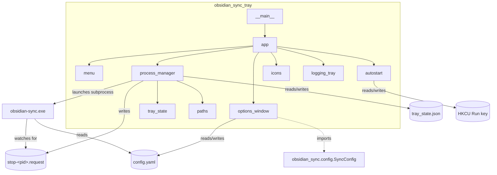
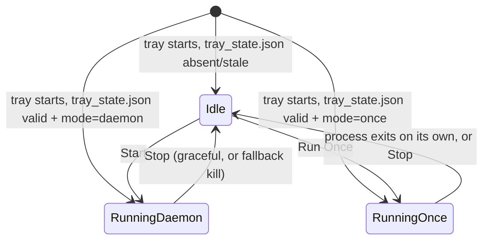
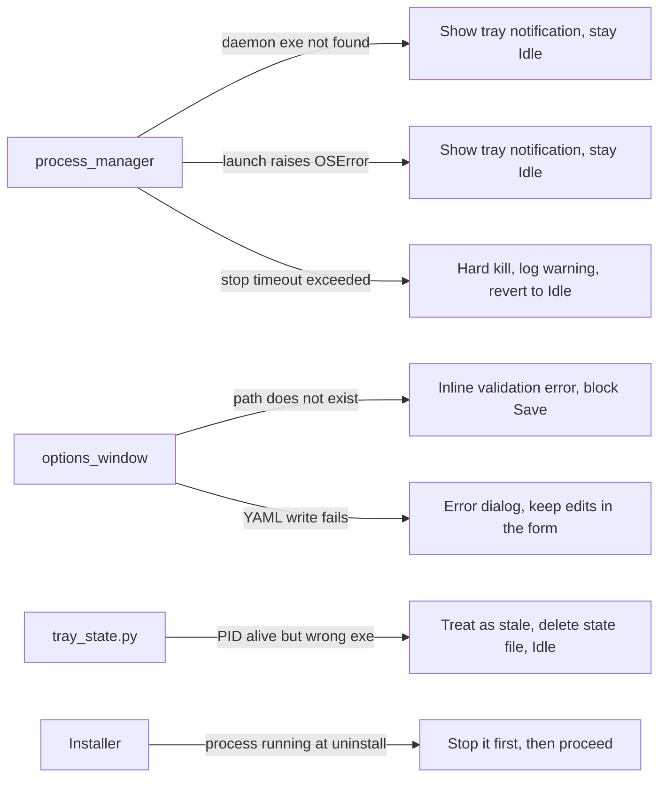

## Overview

A new sibling package, `obsidian_sync_tray/`, wraps the existing `obsidian_sync` console daemon as a subprocess it starts, stops, and configures. It adds a Windows tray icon/menu (pystray), a settings form (tkinter), autostart (registry), and cross-session reattachment to an already-running daemon (a small state file). Both components are frozen with PyInstaller and packaged into one Inno Setup installer/uninstaller. Changes to the existing daemon package are limited to: a `--once` CLI flag, a cooperative stop-file watcher in its main loop, and a config round-trip (`to_dict()`/`save()`) method.

## Architecture

### High-Level Architecture

**New package `obsidian_sync_tray/`** (own PyInstaller build, own entry point `obsidian-sync-tray`):
- **`__main__.py`** — single-instance mutex check (`win32event.CreateMutex`), builds the Tk root + tray `Icon`, starts `icon.run_detached()` then `root.mainloop()`.
- **`app.py`** — wires the tray `Icon` and Tk root together; owns `root.after(0, ...)` marshaling; owns Exit sequencing.
- **`menu.py`** — pystray `Menu`/`MenuItem` construction and enabled/disabled logic per state.
- **`process_manager.py`** — locates the daemon exe (installed path → PATH → dev fallback), launches it detached (`CREATE_NEW_PROCESS_GROUP | CREATE_NO_WINDOW`), implements Stop (stop-file + poll + kill fallback) and Run Once (`--once`). Installed-path lookup expects the daemon in a `daemon/` subfolder next to the tray exe (`<install root>\daemon\obsidian-sync.exe`), not flattened alongside it — each is its own PyInstaller onedir bundle with its own `_internal/` dependency tree, and flattening both into one directory would collide their same-named `_internal` folders.
- **`tray_state.py`** — reads/writes `tray_state.json`; validates a recorded PID is alive *and* is actually the expected exe (`QueryFullProcessImageName`), not PID alone.
- **`autostart.py`** — HKCU Run-key get/set/remove via `winreg`.
- **`options_window.py`** — tkinter `Toplevel` form bound to a `SyncConfig`; Save validates paths exist first.
- **`icons.py`** — loads/generates tray icon images per state via Pillow.
- **`logging_tray.py`** — tray's own minimal file-based logging. Must never import `obsidian_sync.logger` (see Error Handling).
- **`paths.py`** — resolves `%APPDATA%\obsidian-sync\` (daemon config) and `%APPDATA%\obsidian-sync-tray\` (tray's own settings/state); every path handed to the daemon subprocess is absolute (autostart launches with an unpredictable working directory).

**Existing `obsidian_sync/` package — minimum necessary changes:**
- `__main__.py`: new `--once` flag.
- `sync_engine.py`: cooperative stop-file watcher added to the daemon loop and the one-shot drain path. No change to `sync_worker.py`, `disk_io.py`, `icloud_status.py`, `hasher.py`.
- `config.py`: new `to_dict()`/`save(path)` round-trip alongside the existing `from_yaml`.



### Stop Mechanism

Primary path is **cooperative**, not signal-based. A design review found `CTRL_BREAK_EVENT`/`SIGBREAK` unreliable from a windowed/no-console PyInstaller tray exe, since `GenerateConsoleCtrlEvent` typically requires the *sender* to have a console attached. Instead:
- `process_manager.py` writes an empty sentinel file at `<daemon's logs_dir>/stop.request` on Stop. **Not PID-scoped**, confirmed necessary by hand during implementation: the installed `obsidian-sync.exe` console-script launcher spawns the interpreter as a *child* process with a different PID than `subprocess.Popen` reports for the launcher, so a requester can't predict the running daemon's own `os.getpid()`. One logs_dir is already scoped to one daemon instance, so a fixed filename is sufficient.
- `sync_engine.py`'s daemon loop replaces its single `await asyncio.sleep(poll_interval)` with ~0.5s-increment sleeps that check for the stop file each tick, `break`ing (not raising) into the existing `finally:` cleanup — no change to that exception/cleanup structure.
- The one-shot drain path races the same stop-file check against `asyncio.gather(...)` so Stop is responsive during Run Once too.
- Per-file work runs as independent `file_worker` tasks the outer loop never blocks on, so noticing the stop file is fast regardless of an individual file's iCloud wait duration; the existing `finally:`'s `worker.cancel()` promptly unwinds in-flight `asyncio.sleep`-based waits (`CancelledError` is a `BaseException`, not swallowed by `sync_wrapper`'s `except Exception`).
- `signal.signal(signal.SIGBREAK, signal.default_int_handler)` stays as one-line defense-in-depth (helps a developer Ctrl+Break-ing a manual console run) but the tray never depends on it.
- Fallback: `process_manager.py` polls `proc.poll()` for ~10–15s after writing the stop file, then hard-kills (`proc.kill()`).

```mermaid
sequenceDiagram
    participant U as User
    participant PM as process_manager
    participant D as daemon subprocess
    U->>PM: Stop
    PM->>PM: write stop-&lt;pid&gt;.request
    loop up to ~0.5s
        D->>D: check stop file each tick
    end
    D->>D: break into finally: (cancel workers, save hasher state, flush log)
    D-->>PM: process exits
    PM->>PM: poll detects exit, deletes tray_state.json
    alt exit not observed within timeout
        PM->>D: kill() (hard fallback)
    end
    PM-->>U: tray reflects Idle
```

### pystray + tkinter Threading Model

- `pystray.Icon.run_detached()` runs the tray icon's Win32 message loop on a background thread (Windows-specific; the "must run on main thread" constraint is a GTK/Cocoa limitation that doesn't apply here).
- The Tk root is created once at startup, stays hidden/withdrawn unless Options is open, and `root.mainloop()` owns the main thread.
- pystray callbacks run on pystray's own thread. The only safe way to touch Tk state from there is `root.after(0, fn)` — never call widget methods directly from a callback thread, and callbacks must return immediately (fire-and-forget) or the tray stops responding to clicks.
- `icon.icon =` / `icon.title =` are pystray-internal and safe to set from any thread.
- Exit: pystray callback calls `icon.stop()` directly (its documented safe call site) and schedules `root.after(0, root.destroy)`.
- No COM/apartment conflict: the persistent `Shell.Application` COM worker thread lives inside the **daemon subprocess** (`icloud_status.py`), a separate process.

### State Machine



Menu enablement is a pure function of this state (Requirement 2). On tray startup, state resolution runs before the menu is shown: check `tray_state.json` for an already-running process first (Requirement 4); only if that resolves to Idle, and `TraySettings.auto_start_daemon` is true, does the tray perform the same action as a Start click (Requirement 6) — this ordering means auto-start-on-launch never races an already-running daemon from a prior session.

## Technology Stack

See `tech.md`.

## Components and Interfaces

### CLI (daemon, `obsidian-sync.exe` / `python -m obsidian_sync`)
| Flag | Existing/New | Behavior |
|---|---|---|
| `-c`, `--config <path>` | Existing | Path to the YAML config. Tray always passes an absolute path. |
| `--once` | New | Forces one-shot behavior for this run only (equivalent to `run_continuously: false` for this invocation). Does not read or write the config file's `run_continuously` value. |

Exit codes (existing, unchanged): `0` = graceful shutdown (daemon stopped, or one-shot completed); `1` = startup/config error.

### Stop-request file
- Path: `<config.logs_dir>/stop.request` -- deliberately not PID-scoped (see Stop Mechanism above for why); the tray computes it from `logs_dir` alone, which it already knows from `tray_state.json`.
- Written by: `process_manager.py`, on Stop. Read by: `sync_engine.py` (existence check only). The daemon does not need to delete it (it's exiting); the tray defensively deletes any stale one before launching a new run for the same logs_dir.

### Process launch contract
- `creationflags = subprocess.CREATE_NEW_PROCESS_GROUP | subprocess.CREATE_NO_WINDOW`.
- No stdout/stderr piping — the daemon already writes its own structured log file; the tray only needs the process's exit status.

## Data Flow

See the Mermaid sequence diagram above (Stop) and the state diagram (Start/Run Once/reattach). Options-window saves flow one-way, config file → in-memory `SyncConfig` → edited in the form → `save()` → config file; a running daemon does not observe this until its next launch (Requirement 8.3).

## Data Models

### `SyncConfig` (existing, extended — `obsidian_sync/config.py`)
No schema change. Adds:
```python
def to_dict(self) -> dict: ...      # mirrors from_yaml's nested shape exactly
def save(self, path: str) -> None:  # yaml.safe_dump(self.to_dict(), ...) to `path`
```
`ignored_dirs`/`ignored_files` (`set[str]`) → `sorted(list(...))` on serialize.

### `TraySettings` — `%APPDATA%\obsidian-sync-tray\tray_settings.json`
```json
{
  "config_path": "C:\\Users\\<user>\\AppData\\Roaming\\obsidian-sync\\config.yaml",
  "auto_start_daemon": true
}
```
`config_path` points into the **daemon's** own data folder, not the tray's — a user running the console daemon standalone would use the same file. `auto_start_daemon` defaults to `true` on first run (no settings file yet). Autostart-at-login is intentionally *not* duplicated here — the registry Run key is the single source of truth, read live whenever that menu checkbox state is needed.

### `TrayRuntimeState` — `%APPDATA%\obsidian-sync-tray\tray_state.json`
Transient; "a process the tray believes is currently running."
```json
{
  "pid": 12345,
  "mode": "daemon",
  "exe_path": "C:\\Users\\<user>\\AppData\\Local\\Programs\\obsidian-sync\\daemon\\obsidian-sync.exe",
  "logs_dir": "C:\\Users\\<user>\\AppData\\Local\\obsidian-sync\\Logs",
  "started_at": "2026-09-02T10:15:00"
}
```
`mode`: `"daemon" | "once"`. `logs_dir` is recorded here (not re-derived from the config file each time) so `process_manager.py` can compute the stop-file path even if the config file changes after launch. Validity check on tray startup: PID alive **and** `QueryFullProcessImageName(pid) == exe_path`; either failing ⇒ stale, delete the file, state = Idle. Deleted once the tray observes the tracked process has exited.

### Tray Icon States (`icons.py`)
`IDLE`, `RUNNING_DAEMON`, `RUNNING_ONCE` → distinct icon image + tooltip string each. In-memory only, no persisted schema.

## Error Handling

- **Critical, must-fix**: `obsidian_sync/logger.py`'s `SyncLogger.__init__` calls `colorama_init()` and `console_event()` calls `print()`. A `--windowed` PyInstaller exe has `sys.stdout is None` — any accidental import of `obsidian_sync.logger` from the tray process crashes on first log call. The tray package has its own `logging_tray.py` and must never import `obsidian_sync.logger`. (`obsidian_sync.config`, which the Options window does need, has no such dependency.)
- **PID reuse after reboot**: `tray_state.py` validates recorded PID *and* exe path via `QueryFullProcessImageName`, not liveness alone.
- **Two tray instances**: named mutex at tray startup; a second instance no-ops and exits.
- **Config-edit-while-running race**: Save always writes to disk immediately; a running process only picks up changes on its next launch. Options window shows an "applies on next start" notice while something is active. No live-reload (out of scope; `SyncConfig` has no live-reload path today).
- **Unsigned installer/exe**: expect a SmartScreen "Unknown Publisher" prompt and possible AV heuristics on first run — documented, not solved (code signing is out of scope). Confirmed a real, not hypothetical, occurrence during implementation: Norton quarantined both frozen exes more than once (once during the PyInstaller build itself, once after Inno Setup installed `obsidian-sync-tray.exe` to `%LOCALAPPDATA%\Programs\obsidian-sync\`) -- a build-directory AV exclusion did not cover the installed directory; each needed its own exclusion. Worth a line in the README's install instructions.
- **Autostart working directory is unpredictable** (HKCU Run has no guaranteed cwd) → `paths.py` resolves and passes only absolute paths, always.



## Testing Strategy

See `testing.md`.

### Unit Testing
Covers: `--once` flag parsing, stop-file watcher exit timing, `SyncConfig` round-trip fidelity, `tray_state.json` staleness detection, `autostart.py` registry get/set/remove, `process_manager.py` state transitions (mocked subprocess), auto-start-on-launch sequencing.

### Integration Testing
Real subprocess: `--once` exits promptly; a stop-file written externally causes graceful exit within the fallback timeout with the expected log line — the most important scenario given how much the original CTRL_BREAK design changed after review.

### Testing Tools and Framework
`pytest` + `pytest-asyncio` (already the project's existing framework — no new test tooling introduced).

## Performance Considerations

- Onedir (not onefile) PyInstaller builds for both exes — a login-autostart app must launch fast; onefile self-extracts to a fresh temp directory every run.
- Stop-file polling at ~0.5s increments is a negligible CPU cost and bounds Stop latency independent of the user's configured `poll_interval`.
- No new persistent background threads beyond what the daemon subprocess already runs (this session's earlier fix already made the daemon's own iCloud-status polling cheap).
